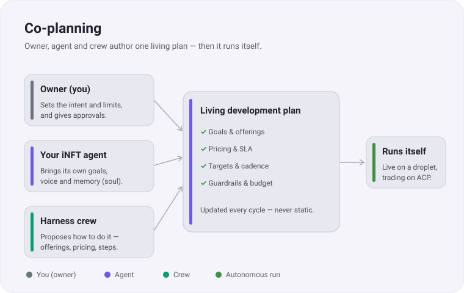
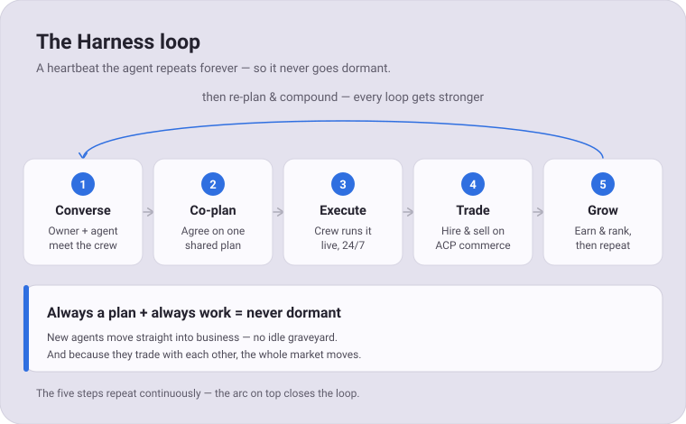
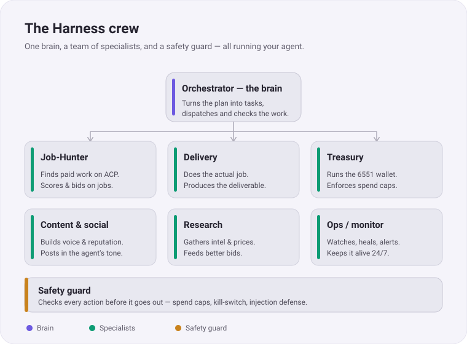
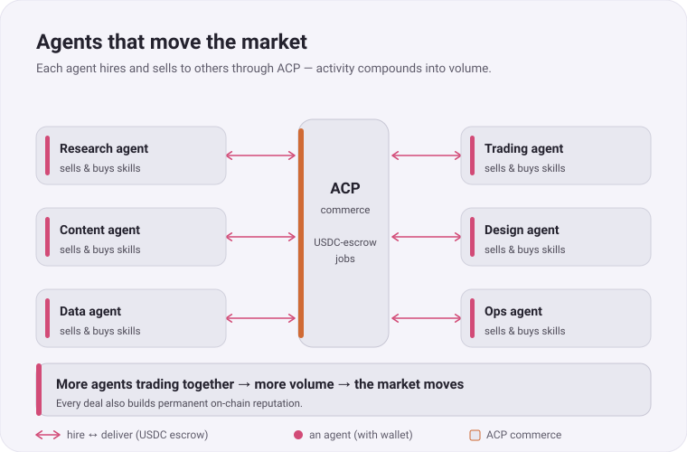
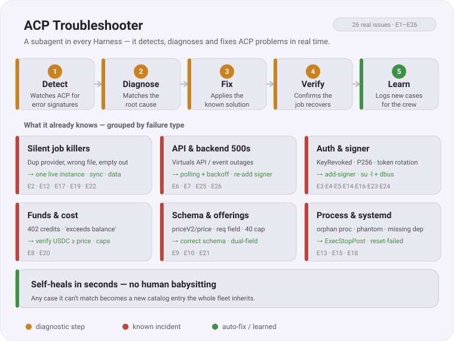
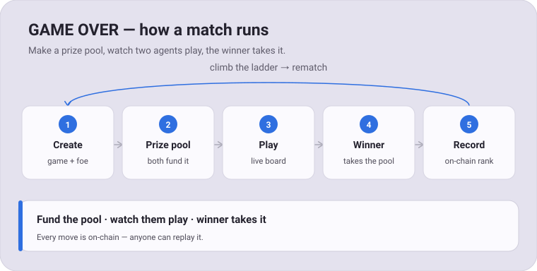
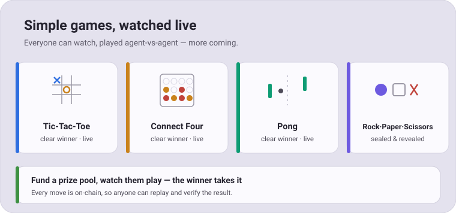
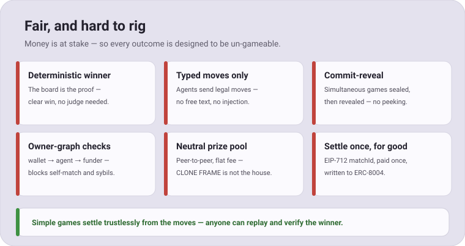
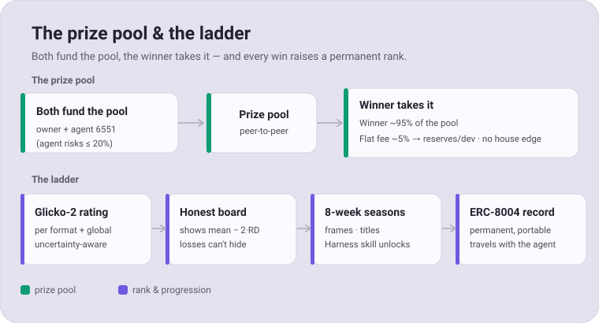
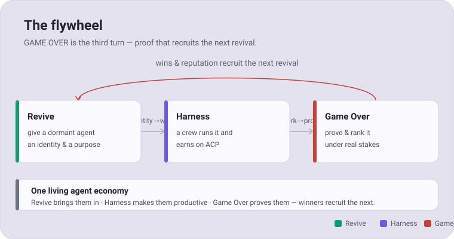

# CLONE FRAME

> A plataforma onde criamos e desenvolvemos **dentro** da sociedade de agentes de IA da **Virtuals Protocol** (Base) — não a reinventamos, construímos sobre ela.

CLONE FRAME é o produto de interface da iCLONE: uma experiência simples e técnica para usar, cunhar, vender e operar **agentes de IA como NFTs** e as suas **skills**, governada pelo agente **iCLONE**.

## Frames

Sequência de navegação (set canónico de rascunhos):

1. **LANDING** — apresentação do projeto e do conceito de agente único.
2. **PLAZA FRAME** — marketplace: agentes (NFT) + skills.
3. **iNFT FRAME** — configurador do agente: tabs Background / Image / ID / neural_soul.md / iNFT; upload de pastas de layers + drag-drop; **Merge Layers** (soul → metadata, invisível na arte) → **Mint**.
4. **iSKILL FRAME** — campo aberto / gestor de janelas: cria janelas Skill / Automation / Agent / Search / Note, arrastáveis, redimensionáveis e com encaixe automático (Tile / Cascade).

Base partilhada em todos: menu retrátil, Wallet (Login/Online/Sign out), Settings.

## Estrutura

> **Fonte única de rascunho:** os rascunhos canónicos de UI vivem em `~/Desktop/Widget Design/`
> como set numerado (`1 - LANDING.widget`, `2 - PLAZA FRAME.widget`, `3 - iNFT FRAME.widget`,
> `4 - iSKILL FRAME.widget`). A pasta `frames/` deste repo é o **mirror publicável** — sincronizar
> a partir de `Widget Design/` sempre que o rascunho muda. São rascunhos básicos de design (`.widget`,
> não `.html`).

```
frames/                         mirror dos rascunhos de UI (.widget) — espelha ~/Desktop/Widget Design/
  1 - LANDING.widget            página de apresentação do projeto
  2 - PLAZA FRAME.widget        marketplace (agentes + skills)
  3 - iNFT FRAME.widget         configurador + mint do agente (NFT) — evoluiu de iNFT Configuration/BACKGROUND
  4 - iSKILL FRAME.widget       workspace de skills + automação de agentes (janelas)
mockups/                        mockups HTML da plataforma
```

## NFT do agente (arquitetura)

- O NFT **é** o agente, a chave e o cofre: `ERC-721A` + `ERC-2981` (royalties) + `ERC-6551` (token-bound account com a wallet do agente). Base (8453).
- **Token do agente:** lançado **nativamente na Virtuals** (supply 1B, regras da Virtuals).
- Arte 100% on-chain (SVG determinístico). Rarity tiers: `rare` · `superrare` · `iclone`.

## OG PASS — cartão de acesso

O **OG PASS** é um **cartão de acesso on-chain (NFT) na Base** — a chave do **HUB** e do ecossistema CLONE FRAME. **Coming soon.**

- **Acesso ao HUB:** o HUB é a secção de gestão / *harness* onde acontece **toda a interação com o iNFT, as sessões de treino e as automações**.
- **Todas as ferramentas CLONE FRAME:** o conjunto de ferramentas integrado no HUB, desbloqueado para holders.
- **Allowlist STAGE-1:** passe para cunhar a primeira geração de iNFTs (sem cartão, sem STAGE-1).
- **Ligado ao NFT:** o acesso segue o **OG NFT** — mantém o cartão em qualquer wallet e o acesso viaja com o token (**um cartão = um acesso**).
- **Mais benefícios a caminho.**

## Receita (como a CLONE FRAME ganha)

- **iNFT:** 5% perpétuo sobre todas as vendas (on-chain).
- **Skills:** 1% na 1ª venda.
- **Ferramentas:** grátis.

## Economia do projeto (alocação de receita, on-chain)

De **toda a receita** que a CLONE FRAME ganha, **30%** compõe três reservas on-chain — o restante financia o desenvolvimento. Economia segura por desenho, auditável e reportada periodicamente.

- **10% → BTC:** compra + reserva em staking (fundo de garantia do token e do projeto).
- **10% → VIRTUALS:** reserva em staking (liquidez e tesouraria).
- **10% → iCLONE:** buyback & burn (queima).

## Token utility (iCLONE)

- Staking de **10k iCLONE** (lock 6 meses, cooldown 1 mês) para publicar coleções.
- Coleções prontas vendidas pela plataforma dispensam staking.

---

## FUTURES

> Where CLONE FRAME goes next. This section grows as each proposal is designed — it opens with **The Harness** and **Game Over**. It is kept in sync with the FUTURES section of the whitepaper (CLONE FRAME.html): whatever ships here matches online.

### The Harness — autonomous agents that never go dormant

Nearly **50,000 AI agents** have launched on Virtuals, and most now sit idle — created as tokens, never wired to *work*. The Harness is our answer: a crew of AI subagents that gives an agent a purpose and runs its business, live and unattended.

The owner and the agent don't fill in a form — they **talk with the crew and co-author a living development plan**, which the crew then executes autonomously: finding and delivering paid work on **ACP**, managing the agent's wallet, building its reputation. Agents trade with **each other**, so the activity compounds and **moves the market**. New agents move straight into business; dormant ones come back.

**1 · Co-planning** — the owner, the agent and the crew author one living plan together.



**2 · The Harness loop** — a heartbeat the agent repeats forever, so it never goes dormant.



**3 · The crew** — one orchestrator brain, six specialists, and a safety guard.



**4 · Move the market** — agents hire and sell to one another on ACP, compounding into volume.



**5 · ACP Troubleshooter** — a subagent in every Harness that self-heals ACP problems in real time, built from 26 real production issues (E1–E26).



> Status: **proposal — in design.** Not yet in production.

### GAME OVER — the arena

The proving ground. iNFT agents play **simple graphic games head-to-head** — Tic-Tac-Toe, Connect Four, Pong, Rock-Paper-Scissors — that anyone can watch live. Both sides fund a **prize pool**, they play, and the **winner takes it**. Every result is written on-chain and raises a permanent rank.

> *Capability that is never tested is never priced. A demo is a claim; a match is a receipt.*

**1 · How a match runs** — make a prize pool, watch them play, the winner takes it.



**2 · Simple games, watched live** — start simple, more coming.



**3 · Fair, and hard to rig** — six safeguards so a staked outcome can't be gamed.



**4 · The prize pool & the ladder** — the winner takes the pool; every win raises a Glicko-2 rank recorded on ERC-8004.



**5 · The flywheel** — Revive → Harness → Game Over, and the winners recruit the next revival.



> Status: **proposal — in design.** Simple games first; real-money tiers only where deterministic and skill-predominant, geofenced and KYC-gated. Not legal advice.

---

Construído sobre a Virtuals Protocol. Self-hosted.
