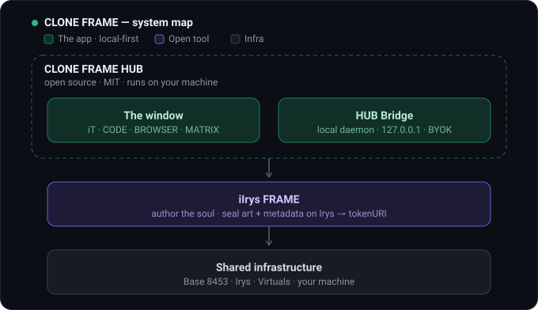
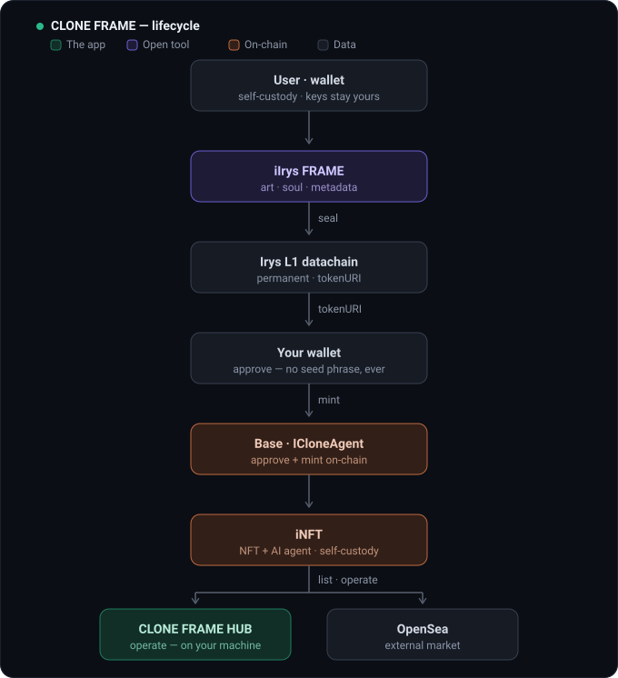
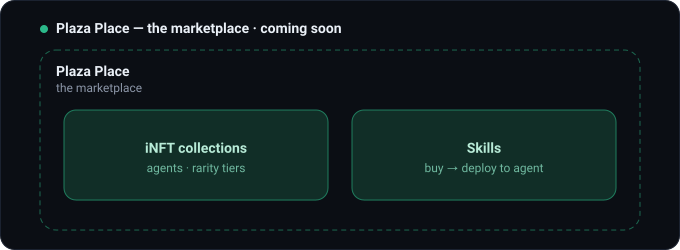
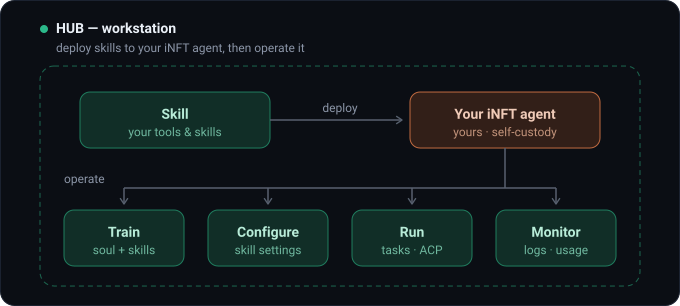
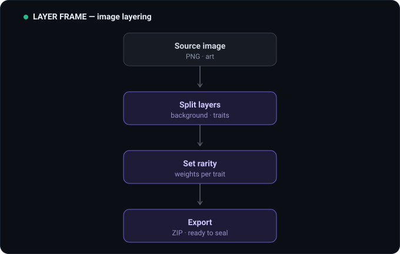
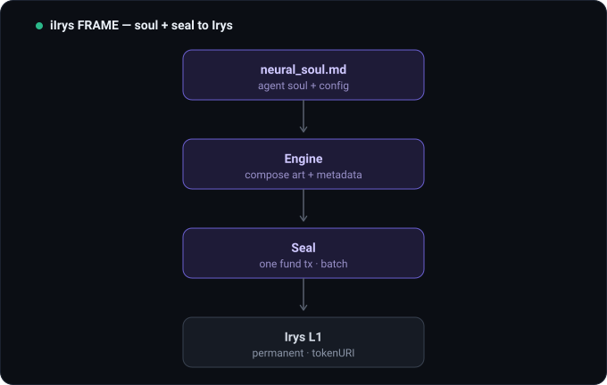
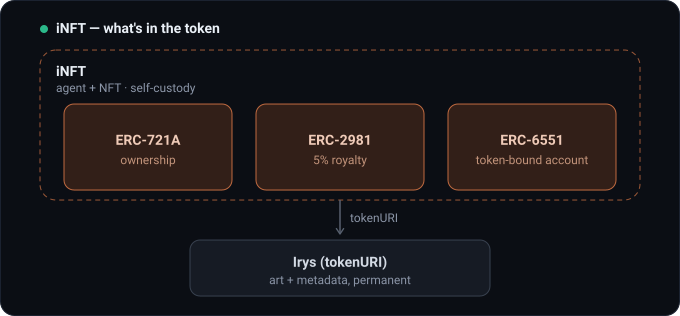

# CLONE FRAME

> Criamos e desenvolvemos **dentro** da sociedade de agentes de IA da **Virtuals Protocol** (Base) — construímos sobre ela, não a reinventamos.

CLONE FRAME é a plataforma de interface da iCLONE: usar, cunhar, vender e operar **iNFTs** — agentes de IA com NFT integrado — e as suas **skills**.



## Modelo de produto

O ecossistema tem dois níveis: **Frames** (produtos) e, dentro do CLONE FRAME, **superfícies**.

### Frames (produtos)

- **CLONE FRAME** — plataforma hospedada (Hostinger). Reúne duas superfícies:
  - **Plaza Place** — o marketplace. Duas secções:
    - **iNFT collections** — agentes (iNFT) listados para compra / mint.
    - **Skills** — só se vendem **skills** aqui; compras a skill e depois fazes **deploy** dela ao teu agente.
  - **HUB** — workstation: treinar, fazer deploy e operar o teu agente iNFT.
- **LAYER FRAME** — ferramenta aberta: estúdio de **camadas de imagem** para arte de NFT (split + AI auto-layer, Floor/Glow, slots iQR + Description, export). É **aqui** que se geram as camadas da arte — substitui o antigo "gerador de imagem / SILUETAS". Repo: [devclone20/ilayerframe](https://github.com/devclone20/ilayerframe).
- **iIrys FRAME** — ferramenta aberta: recebe as camadas do LAYER FRAME, define a alma (`neural_soul.md`) + metadata e **sela tudo na Irys** (gera o `tokenURI`). Repo: [devclone20/iIrysframe](https://github.com/devclone20/iIrysframe).

As ferramentas (LAYER + iIrys) são **open-source e grátis**, distribuídas no **GitHub + Venice**. Apenas o CLONE FRAME (Plaza + HUB) é hospedado, em **BYOK** — cada utilizador usa a sua própria chave de LLM.

Base partilhada em todas as superfícies: menu retrátil, Wallet (Login/Online/Sign out), Settings.

## Arquitetura

Diagramas (camadas + fluxo ponta-a-ponta) em **[docs/ARCHITECTURE.md](docs/ARCHITECTURE.md)**.

### Ciclo de vida

Do login ao publish — criar → selar → cunhar → publicar.



### Os frames em detalhe

**Plaza Place** — o marketplace (iNFT collections + Skills).



**HUB** — a workstation: deploy de skills ao agente e operação.



**LAYER FRAME** — pipeline de layering da imagem.



**iIrys FRAME** — alma + metadata + selar na Irys.



### iNFT

- **iNFT = agente de IA + NFT integrado.** Dá identidade e posse on-chain ao agente; **self-custody** (fica na carteira do utilizador).
- Contrato **ICloneAgent** na Base (8453): `ERC-721A` + `ERC-2981` (royalty 5%) + `ERC-6551` (token-bound account).
- `tokenURI` aponta para a **Irys** (arte + metadata permanentes); a alma é injetada em `metadata.ai_soul`.
- Rarity tiers: `rare` · `superrare` · `iclone`.



### Mint & publicação

- O comprador/dev **aprova + cunha on-chain** com o contrato ICloneAgent (não há "redirect para a Virtuals aprovar").
- Após o mint, o iNFT é **publicado** no **Plaza (CLONE FRAME)** e na **OpenSea**.

### Infraestrutura partilhada

`Base 8453` · `Irys` (datachain permanente) · `Virtuals Protocol` (ACP) · `Supabase`.

## Receita

- **iNFT:** 5% perpétuo em todas as vendas (embutido no contrato).
- **Skills:** 1% na 1ª venda.
- **Ferramentas:** grátis (o 5% aplica-se quando a tool é cunhada como iNFT).

## Token utility (iCLONE)

- Staking de **10 000 iCLONE** (lock 6 meses + 1 mês de cooldown) para publicar coleções.
- Coleções prontas vendidas pela plataforma dispensam staking.

## Distribuição

- **Venice** — ferramentas abertas (self-hosted, uso privado/comunidade).
- **Hostinger** — CLONE FRAME público para a comunidade.

## Estrutura do repo

```
frames/      widgets .widget dos frames (rascunhos de UI)
mockups/     mockups HTML da plataforma
docs/        arquitetura e documentação
```

---

Construído dentro da Virtuals Protocol. Base (8453).
