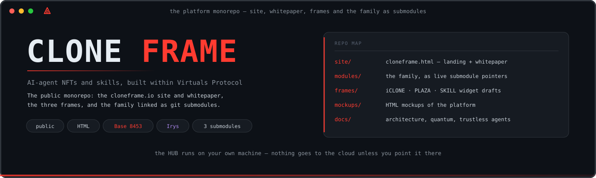
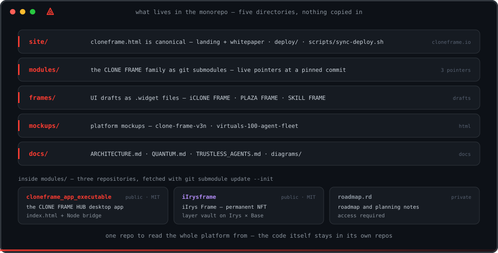
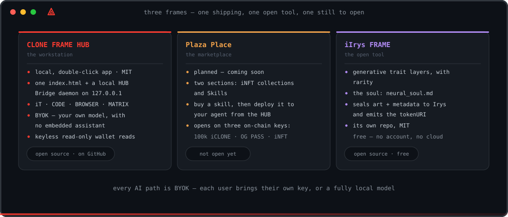
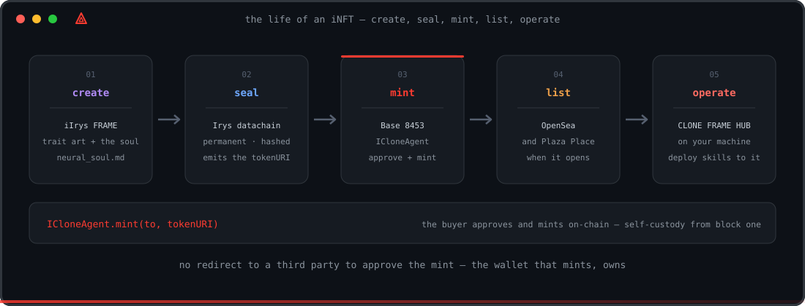
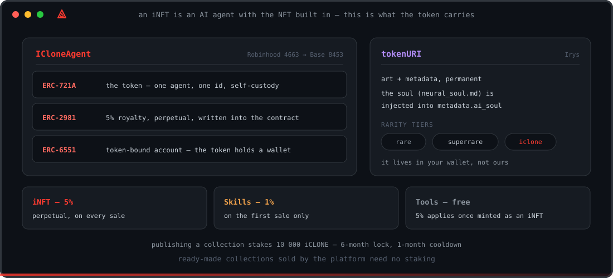
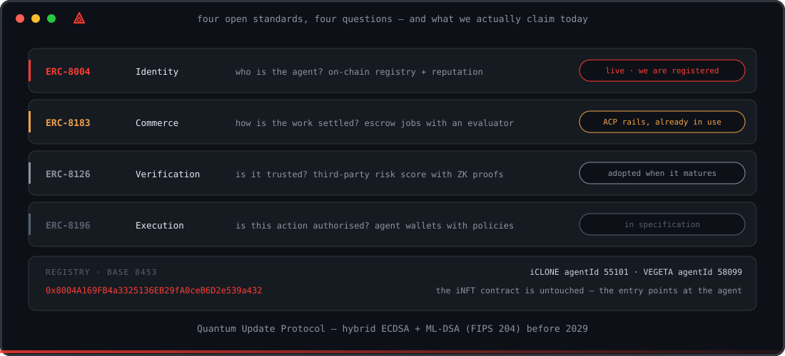

  

  
  
  
  
  
  
  

# CLONE FRAME

> Plataforma independente que **integra com** a sociedade de agentes de IA da **Virtuals Protocol** (Base) — construímos sobre os carris dela, não a reinventamos.

CLONE FRAME é a camada de interface da iCLONE: criar, cunhar, possuir e operar **iNFTs** — agentes de IA com NFT integrado — a partir de uma app que corre **na máquina do próprio utilizador**.

**The launch is multi-chain.** The collection lands first on **Robinhood Chain** (chain ID
4663, an Arbitrum-Orbit L2 — [docs.robinhood.com/chain](https://docs.robinhood.com/chain/connecting)),
then on **Base** (Ethereum L2, chain ID 8453), with further chains after those.

## Estrutura do repo

Este repositório é o mapa da plataforma: o site, os mockups, os rascunhos de UI, a
documentação — e a família de repos ligada por submódulos, sem nada copiado para dentro.

  

## Modelo de produto

O ecossistema tem dois níveis: **Frames** (produtos) e, dentro do CLONE FRAME, **superfícies**.

  

### Frames (produtos)

- **CLONE FRAME HUB** — a workstation: **app local, open-source (MIT), de duplo-clique** — um `index.html` que desenha a interface inteira + um daemon local ("HUB Bridge") em `127.0.0.1`. Terminal iT, browser privado embutido, CODE a conduzir o modelo do próprio utilizador (BYOK — sem assistente embutido), cluster local MATRIX, leituras de carteira sem chaves. Repo: [devclone20/cloneframe_app_executable](https://github.com/devclone20/cloneframe_app_executable).
- **Plaza Place** — o marketplace (iNFT collections + skills). **Planeado — coming soon**; abre com as três chaves on-chain (100k $ICLONE · OG PASS · iNFT da casa).
- **iIrys FRAME** — ferramenta aberta: autoria a **arte** (camadas de traits generativas com raridade) e a **alma** (`neural_soul.md`) + metadata, e **sela tudo na Irys** (gera o `tokenURI`). Repo: [devclone20/iIrysframe](https://github.com/devclone20/iIrysframe).

**Tudo é open-source e grátis** — o próprio HUB (MIT, no GitHub) e a iIrys FRAME. Nada corre na cloud a menos que o utilizador aponte para lá, e todos os caminhos de IA são **BYOK** — cada utilizador liga a sua própria chave de LLM, ou um modelo totalmente local.

Base partilhada em todas as superfícies: menu retrátil, Wallet (Login/Online/Sign out), Settings.

## Arquitetura

Diagramas de camadas e fluxo em **[docs/ARCHITECTURE.md](docs/ARCHITECTURE.md)**.

### Ciclo de vida

Do login ao publish — criar → selar → cunhar → listar → operar.

  

### iNFT

- **iNFT = agente de IA + NFT integrado.** Dá identidade e posse on-chain ao agente; **self-custody** (fica na carteira do utilizador).
- Contrato **ICloneAgent**, multi-chain — **Robinhood Chain** (4663) → **Base** (8453): `ERC-721A` + `ERC-2981` (royalty 5%) + `ERC-6551` (token-bound account).
- `tokenURI` aponta para a **Irys** (arte + metadata permanentes); a alma é injetada em `metadata.ai_soul`.
- Rarity tiers: `rare` · `superrare` · `iclone`.

  

### Mint & publicação

- O comprador/dev **aprova + cunha on-chain** com o contrato ICloneAgent (não há "redirect para a Virtuals aprovar").
- Após o mint, o iNFT é listado na **OpenSea** (e no **Plaza**, quando abrir) e trabalhado a partir do **HUB**, na máquina do dono.

### Infraestrutura partilhada

`Robinhood Chain 4663` · `Base 8453` · `Irys` (datachain permanente) · `Virtuals Protocol` (ACP) · **a máquina do dono** (o HUB é local-first — um ficheiro + um daemon em loopback).

## Receita

- **iNFT:** 5% perpétuo em todas as vendas (embutido no contrato).
- **Skills:** 1% na 1ª venda.
- **Ferramentas:** grátis (o 5% aplica-se quando a tool é cunhada como iNFT).

## Token utility (iCLONE)

- Staking de **10 000 iCLONE** (lock 6 meses + 1 mês de cooldown) para publicar coleções.
- Coleções prontas vendidas pela plataforma dispensam staking.

## Trustless Agents — identidade on-chain

Os agentes estão registados como **Trustless Agents (ERC-8004)** na Base — iCLONE `55101`
e VEGETA `58099`, verificáveis por qualquer pessoa no registry singleton. Adotamos cada
camada da pilha à medida que amadurece, e não reclamamos o que ainda não está de pé.
Detalhe em **[docs/TRUSTLESS_AGENTS.md](docs/TRUSTLESS_AGENTS.md)**.

  

## Quantum Computer Update Protocol

Compromisso de migração pós-quântica **antes de 2029** (prazo de prontidão, não doomsday):
crypto-agility via account abstraction, assinaturas híbridas ECDSA + ML-DSA (FIPS 204),
rotação de chaves por hash-commit; a metadata na Irys já é quantum-safe (hash-based).
Plano completo: [docs/QUANTUM.md](docs/QUANTUM.md).

## Distribuição

- **GitHub** — tudo: o HUB ([cloneframe_app_executable](https://github.com/devclone20/cloneframe_app_executable)), as ferramentas abertas e os monorepos dos agentes.
- **Hostinger** — o site público [cloneframe.io](https://cloneframe.io) (landing + whitepaper), servido a partir de [`site/`](site).

## A forja de agentes — inft-i01

Cada agente da família é um **monorepo iNFT forjado do template
[inft-i01](https://github.com/devclone20/inft-i01)**: um
**[Hermes Agent](https://github.com/NousResearch/hermes-agent)** (Nous Research, MIT) como substrato,
a neural soul do próprio agente por cima, fundido com um NFT — quem detém o token detém
o agente, e o repositório é o corpo dele. iCLONE, VEGETA, Doctor, Akita e Forense já
vivem neste padrão; `ownerOf(tokenId)` controla o agente e a TBA (ERC-6551) do token
pode custodiar os ganhos. Detalhe no whitepaper: [cloneframe.io](https://cloneframe.io).

## Linked repositories

The CLONE FRAME family is linked here as git submodules under
[`modules/`](modules) — live pointers to each repo at a pinned commit, nothing copied:

| Module | Access | What it is |
|---|---|---|
| [`modules/cloneframe_app_executable`](modules/cloneframe_app_executable) | public · MIT | The CLONE FRAME HUB desktop app (`index.html` + Node bridge). |
| [`modules/iIrysframe`](modules/iIrysframe) | public · MIT | iIrys Frame — permanent NFT layer vault on Irys × Base. |
| [`modules/roadmap.rd`](modules/roadmap.rd) | private | Roadmap / planning notes. |

Get them locally with `git clone --recurse-submodules` or `git submodule update --init`.

---

Construído dentro da Virtuals Protocol. Base (8453).
