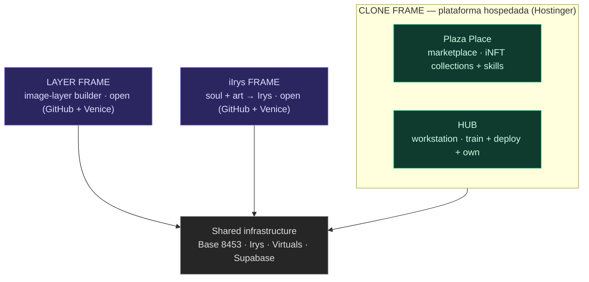
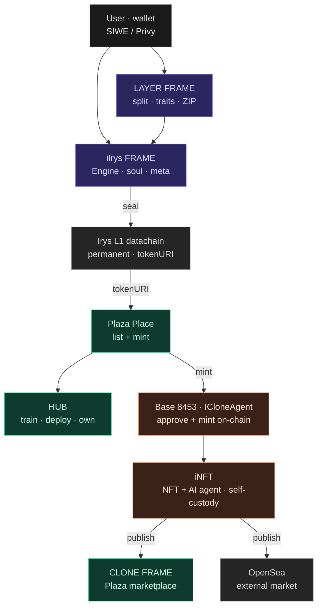

# Arquitetura — CLONE FRAME

Dois níveis: **Frames** (produtos) e, dentro do CLONE FRAME, **superfícies** (Plaza Place + HUB).

## 1. Camadas — hospedado vs aberto

- **Hosted (Hostinger):** Plaza Place + HUB. BYOK.
- **Open (GitHub + Venice):** LAYER FRAME + iIrys FRAME — open-source, grátis.

## 2. Fluxo ponta-a-ponta — criar → selar → cunhar → publicar

**Legenda:** Hosted (verde) · Open tools (roxo) · On-chain (coral) · Data · external (cinza).

## 3. Plaza Place (detalhe)

O marketplace tem duas secções:

- **iNFT collections** — agentes (iNFT) listados para compra / mint. Rarity tiers: `rare` · `superrare` · `iclone`.
- **Skills** — só se vendem **skills** aqui. Fluxo: compras a skill → fazes **deploy** dela ao teu agente iNFT (no HUB).

## 4. iNFT — contrato

- **iNFT = agente de IA + NFT integrado.** Self-custody: fica na carteira do utilizador.
- **ICloneAgent** (Base 8453): `ERC-721A` + `ERC-2981` (royalty 5%) + `ERC-6551` (token-bound account).
- `tokenURI` → Irys (arte + metadata permanentes; a alma `neural_soul.md` é injetada em `metadata.ai_soul`).
- **Mint:** o comprador/dev **aprova + cunha on-chain** com o contrato. Depois **publica** no Plaza (CLONE FRAME) e na OpenSea.

## 5. Infraestrutura

| Camada | Papel |
|--------|-------|
| **Base (8453)** | Chain dos iNFT — mint, royalties (ERC-2981), token-bound accounts (ERC-6551). |
| **Irys** | Datachain permanente — arte, metadata e `tokenURI`. |
| **Virtuals Protocol** | Ecossistema de agentes (ACP); construímos **dentro** dele. |
| **Supabase** | Dados de aplicação (ex.: drops gated). |
