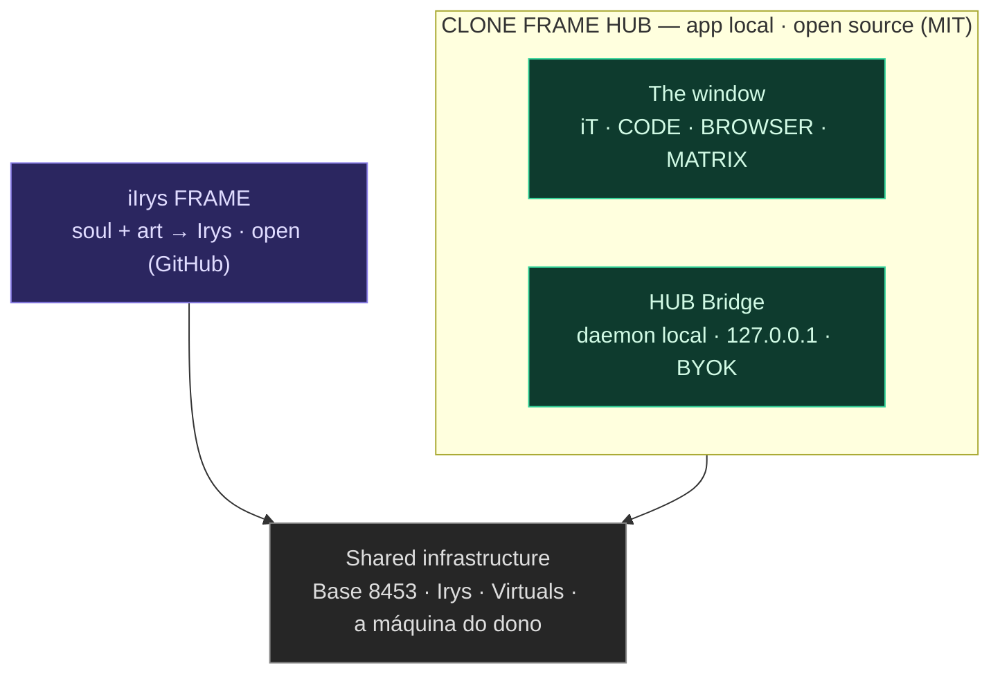
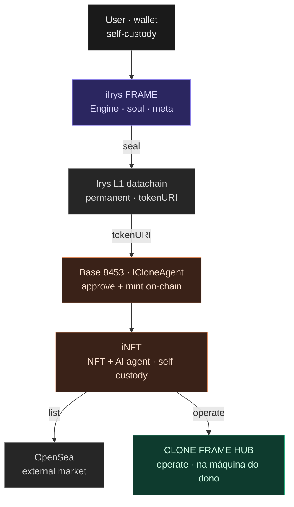

# Arquitetura — CLONE FRAME

Dois níveis: **Frames** (produtos) e, dentro do CLONE FRAME, o **HUB** — a app local, open-source, de duplo-clique (uma janela de ficheiro único + o daemon HUB Bridge em 127.0.0.1). O Plaza Place (marketplace) é **planeado — coming soon**.

## 1. Camadas — a app local e as ferramentas abertas

- **A app (local-first):** o HUB corre na máquina do próprio utilizador — nada na cloud a menos que ele aponte para lá; todos os caminhos de IA são BYOK.
- **Open (GitHub):** o HUB (MIT) e a iIrys FRAME — open-source, grátis.

## 2. Fluxo ponta-a-ponta — criar → selar → cunhar → operar

**Legenda:** A app (verde) · Open tools (roxo) · On-chain (coral) · Data · external (cinza).

## 3. Plaza Place (planeado — coming soon)

O marketplace terá duas secções:

- **iNFT collections** — agentes (iNFT) listados para compra / mint. Rarity tiers: `rare` · `superrare` · `iclone`.
- **Skills** — só se venderão **skills** aqui. Fluxo: compras a skill → fazes **deploy** dela ao teu agente iNFT (no HUB).

## 4. iNFT — contrato

- **iNFT = agente de IA + NFT integrado.** Self-custody: fica na carteira do utilizador.
- **ICloneAgent** (Base 8453): `ERC-721A` + `ERC-2981` (royalty 5%) + `ERC-6551` (token-bound account).
- `tokenURI` → Irys (arte + metadata permanentes; a alma `neural_soul.md` é injetada em `metadata.ai_soul`).
- **Mint:** o comprador/dev **aprova + cunha on-chain** com o contrato. Depois lista na OpenSea (e no Plaza, quando abrir) e **opera a partir do HUB**, na sua máquina.

## 5. Infraestrutura

| Camada | Papel |
|--------|-------|
| **Base (8453)** | Chain dos iNFT — mint, royalties (ERC-2981), token-bound accounts (ERC-6551). |
| **Irys** | Datachain permanente — arte, metadata e `tokenURI`. |
| **Virtuals Protocol** | Ecossistema de agentes (ACP); construímos **dentro** dele. |
| **A máquina do dono** | O HUB é local-first — um ficheiro + um daemon em loopback; os dados vivem em pastas visíveis no disco do utilizador. |

## 6. Repos

| Frame | Repo | Estado |
|-------|------|--------|
| **CLONE FRAME HUB** (a app) | [devclone20/cloneframe_app_executable](https://github.com/devclone20/cloneframe_app_executable) | aberto (MIT) |
| **iIrys Frame** | [devclone20/iIrysframe](https://github.com/devclone20/iIrysframe) | aberto (MIT) |
| **CLONE FRAME** | [devclone20/clone-frame](https://github.com/devclone20/clone-frame) | este repo |
